# Isaac Cavallaro T1_A2-A

# The ACME project

- *ACME Corporation is looking for devs with an understanding of Rails. The following set of questions relate to this RfQ-requirement.*

- *ACME Corporation is very big on project management, documentation and process. This will be a key metric in their decision to award the project. The following set of questions relate to this RfQ-requirement.*

- *Having suffered several cyber attacks in the past and resultant remedial audits ACME Corporation takes compliance, security and privacy very seriously. The following set of questions relate to this RfQ-requirement.*

- *ACME Corporation has specifically requested the app to be based on a relational database. The next set of questions relate to this RfQ-requirement.*

- *Companies (including ACME Corporation) value previous project experience and case studies. The following set of questions relate to this RfQ-requirement.*

# Q1: Describe the architecture of a typical Rails application

- Rails uses MVC as its architecture which stands for:
    - Model

    - View

    - Controller

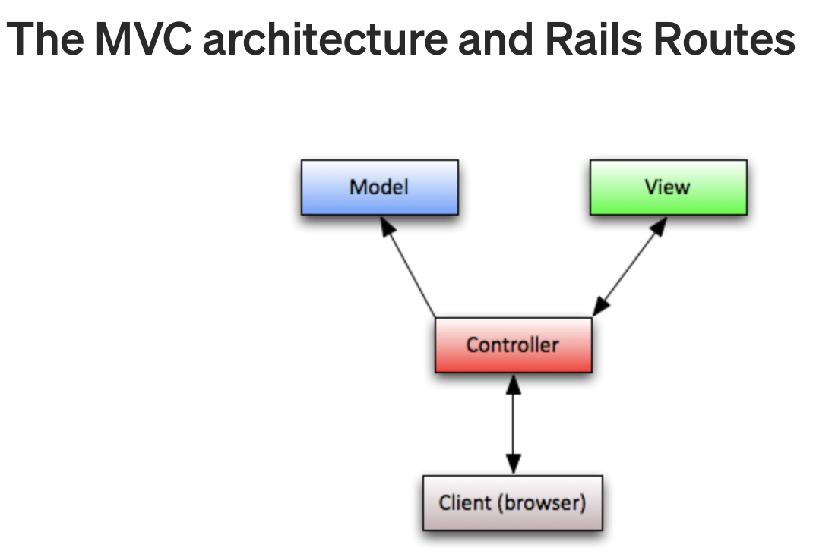

The MVC design pattern divides the responsibilities of an application which Rails follows by convention.

- The *Model* is the representation of the **data**.

- The *View* **displays** the content that is stored **in the model**.

- This is all done through the *Controller*.

## Overview

- First, the user **interacts** with the *View*.

- Some action initiated by the user will **prompt** the *Controller* to either:

    - **Get information** from the *Model* OR

    - **Update** the *Model*: If our user is interacting with our application in a way that **adds data** or **changes data** in our application.

- As the *Model* gets updated (as we update the data that is managed by our application) then the *Controller* will update the *View* to reflect those **changes in the data.**

## Minimum

 At a minimum, in order to get Rails to output "Hello", you need to create a:

- Route

- Controller
    - With an **action** and a *View*.

## Action

An **action** is a *Controller* **method** that respond to http **requests**.
 

## Requests

- When we type a URL into the browser or click on a link, a HTTP request is sent to the server. These requests are:

- GET -> Retrieve a resource (Read)

- POST -> Create a resource

- PUT/PATCH -> Update a resource

- DELETE -> Delete a resource

## Route

A **route** maps a **request** to a **controller action**/controller method. The controller action will handle the request and prepare the data to be displayed by the view. The view will then display this data in the desired format. 

- Routing is a **key part of all websites** with the content of a website being organised within serveral URLs.

- Different URLs and different HTTP methods require different routes. 

- Routing is needed whenever a **URL** is used in an application.

- Rails routes direct **particular requests** to the **particular controller** that can handle the **particular requests**.

## Params

- **Params** is a special object in which you can access everything in it using the hash notation.

        params[:id]

- Everytime there is a collon in the URL it means that this is a parameter or a param.

For example:

        get 'pets/:id to:'pets#show'

- Parameters are used when there is a list of items and we want to just access **one item.**

- The **id** represents a **key in our params.**

- The name of this key depends on what we have named it in our routes.rb folder.

- Therefore the id in our routes folder is very important because:
	
	- Whatever we have in our params depends on whatever name we use in our route.

- A URL parameter captures part of the request path and makes it available within the controller in the params object.

# MVC Breakdown

##  Model

- "A *Model* is a Ruby class that is used to represent data" (Ruby guides, 2021).

- The *Model* represents and manages the content of our application (the data in our application).

- The *Model* is the part of our design pattern that **connects** to the *database* and **retrieves information**, updates wherever we are storing that data for our application.

- The *Model* also is used to **define the data structure** for our data and the **relationships** between the different types of data in our application.

- Lastly, it’s the *Model* in this design pattern that’s **responsible for validating data**. So since the *Model* is the one that is aware of the data structure and what is expected for the data in our application, it’s the *Model* that we make responsible for **validating any use of that data**.

- All rails *Model* objects have an ID attribute. This ID attribute is used to look the *Model* objects up in the database. 

- Rails convention states the name of the ID is used for *Model* record IDs.

- Interestingly, most methods are not defined directly on an application's *Model* classes. Rather, they're inherited from a superclass. For example, the "all" class method is a common method that can be called on a *Model* class inherrited from ApplicationRecordClass.

- Rails will send the database a command in SQL when a *Model* method is called. For example, when the "all" method is called on a *Model* class, each record is converted into an instance of the *Model* class.

## To run the model generator from your terminal:

        bin/rails generate model ModelName attr1:type attr2:type

## For example:

        bin/rails generate model Pet name:string

## View

- The *View* is our user interface and it is responsible for what is actually appearing in the browser.

- The *View* is what the user is interacting with.

- This contains the **display of our application data** and also it exposes the way that the user can interact with our application.

- The *View* is responsible for displaying the content or the data of our application, which of course is received from the model.
So it displays the information to the user and also gives the user ways to interact with that data through our application logic.

### *The View usually though not always take the form of HTML templates with Ruby expressions embedded in them. Those expressions refer to data loaded from the model to populate an HTML page with data* - (Teamtreehouse, 2021).

ADD EXAMPLE

## Partials

- Partials refers to *Partial View*. 

- Partials allow you to take the HTML code that's identical between the templates and move it to a partial view. 

- This allows you to have less code to update when making any changes as any changes made to the partial will be visiable in all the views which use that partial. 

- Therefore partials are a good way to keep Rails projects DRY. 

## Controller

- You can think of the the *Controller* as the brain of this MVC trio or the orchestrator.

- The *View* is interacting with the *Controller* to get information from the *Model* and to update information that is managed by the *Model*.

- In this way, the user goes through the *Controller* to interact with our application.

- The *Controller* also manages the requests that are sent to our application.

- It controls the *Model* and the *View* to generate a response.

- For example: 

    - The *Controller* will recieve a request.

    - Then the *Controller* will load the request data via the *Model*

    - Then the *Controller* will insert that data into the *View.* 

## Generating a controller from the terminal:

        rails g controller (name of controller)

- All of the *Controllers* that we create will inherit from ApplicationController.

- ApplicationController inherites from the ActionContoller module and the Base class in that particular module.

## Render

- The **render** keyword is one way in which we can **send back** a response to our client.

- The **render** keyword is a **method** that can take a number of different arguments with a number of different notations. 

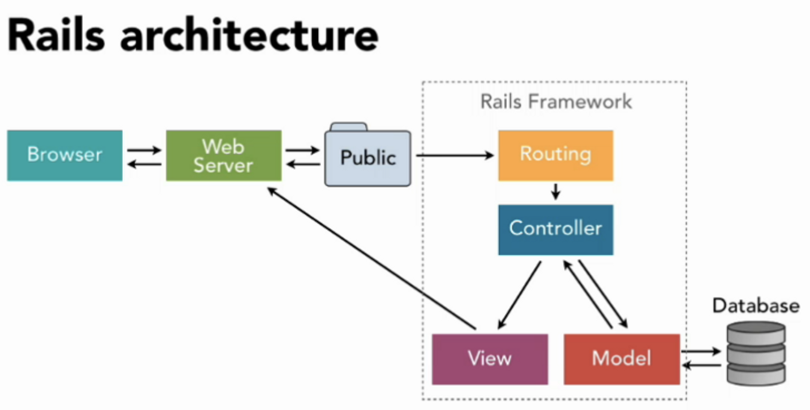

# Q2: Identify a database management system (DBMS) commonly used in web applications (including Rails) and discuss the pros and cons of this database 

## PostgreSQL - Overview

- PostgreSQL is a database management system commonly used in web applications; including Rails. It is an open source object-relational database system which extends the SQL language. PostgreSQL has a positive reputation with regards to its:

    - reliability
    - data integrity
    - extensibility 
    - ability to support multiple languages (Python, Java, Perl. PHP, Ruby, C, C++ etc). 

- PostgreSQL is run by a community of developers who continually contribute to its source code; making it a very reliable DBMS system.

## PostgreSQL - Origins

- PostgreSQL dates back to 1986 where it originated as a part of the POSTGRES project at the University of California. In fact, the *Ingres* project came before POSTGRES, which is where the team leader of the *Ingres* project *Michael Stonebraker* left the university to create POSTGRES. 

## Pros of PostgreSQL

- **Data Types** 

    - "PostgreSQL has a rich set of native data types available to users. Users can add new types to PostgreSQL using the CREATE TYPE command." (postgresqldocs 2021)

- **Open Source**

    - This means that the code is available and may be redistributed and modified.

- **Free**

    - PostgreSQL is released under the OSI-approved PostgreSQL Licence which allows developers to use it for free. 

- **Supports JSON**

    - JSON is a lightweight format for storing and transporting data. 

- **Language Support**

    - Ability to support multiple languages (Python, Java, Perl. PHP, Ruby, C, C++ etc). 

- **Scalable** 

    - PostgreSQL is scalable both in the  quantity of data it can manage and the number of users it can accommodate. 

## Cons of PostgreSQL

- **Not available on all hosts by default**

    - PostgreSQL installation needs to be uniform across all supported operating systems.

- **Not owned by one organization**

    
- **Slower than MySQL** 

    - When comparing performance metrics, PostgreSQL is slower than MySQL. 

## SQL stands for Structured Query Language.

- There are many databases that support reading (querying) data from a database with SQL. 

    - MySQL
    - MS SQL
    - Oracle
    - SQLite
    - PostgreSQL

# Q3: Discuss the implementation of Agile project management methodology 

- The Agile Manifesto was written in 2001 by a group of 17 software developers who were looking to reduce time and resources when developing software. The Agile Manifesto encourages teams to consider how to break down silos that seperate people when working on a project. In this manner, the Agile Manifesto provides expectations for collaboration in addition to setting formal roles and responsibilities.
It emphasizes responding to change over strickly following a plan. Therefore, as priorities change, a team who implements the Agile Manifesto can continue to develop and deliver value. 

- The Agile project management methodology is a strategic approach to managing a project. Specifically, the Agile project management methodology breaks a project up into different phases and originally worked within four main values:

    1. Individuals and interactions over processes and tools

    2. Working software over comprehensive documentation

    3. Customer collaboration over contract negotiation

    4. Responding to change over following a plan

- Today (according to scrumalliance.org) these values or key principles are:

## 12 Agile principles.

1. Our highest priority is to satisfy the customer through early and continuous delivery of valuable software.

2. Welcome changing requirements, even late in development. Agile processes harness change for the customer's competitive advantage.

3. Deliver working software frequently, from a couple of weeks to a couple of months, with a preference to the shorter timescale.

4. Business people and developers must work together daily throughout the project.

5. Build projects around motivated individuals. Give them the environment and support they need, and trust them to get the job done.

6. The most efficient and effective method of conveying information to and within a development team is face-to-face conversation.

7. Working software is the primary measure of progress.

8. Agile processes promote sustainable development. The sponsors, developers, and users should be able to maintain a constant pace indefinitely.

9. Continuous attention to technical excellence and good design enhances agility.

10. Simplicity--the art of maximizing the amount of work not done--is essential.

11. The best architectures, requirements, and designs emerge from self-organizing teams.

12. At regular intervals, the team reflects on how to become more effective, then tunes and adjusts its behavior accordingly.

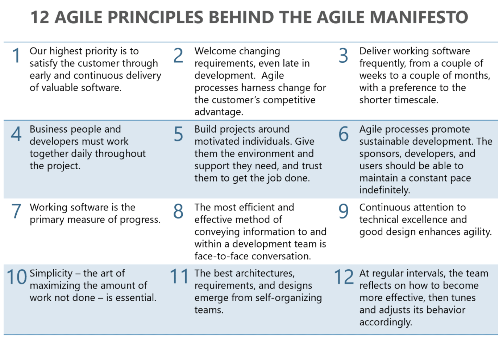

- With these key principles in mind, we can see that Agile uses an iterative and incremental approach to product development; allowing projects to be more flexible and adaptive to changes.
Furthermore, we can see that Agile focuses on critical documentation (such as product requirements) and considers lengthy reports as unnecessary. This however, does not suggests that Agile project management methodology allows developers an excuse to produce low quality products. Rather, Agile aims to provide a workable product after each iteration. 

## Implementating Agile

- Successfully incorporating Agile will require everyone (project team, customer, key stakeholders) to be on board before you begin your project. 

- Given the iterative and incremental nature of Agile, it is best to start with one small project when implementing Agile across a whole organization. 

- After gaining feedback, you can then use Agile on other projects.

- It is also important to keep your team engaged and motivated to have a successful Agile approach to your project. This requires open communication, collaboration and problem solving between all members of the team. 

- Sticking to a selected Agile framework (Daily scrums for example) is important for the success of your project. Although everyone is busy, committing to these are essential to the success of implementing Agile.

- When you are first implementing an Agile methodology, it is critical to follow a proven Agile project management process. In other words, it is important to stick to the rules and not to experiment with hybrid frameworks mid-sprint. Particularly while your team is learning the ropes. 

## Swarming 

- One process used in Agile project management is called “swarming” which is an approach used to optimize flow efficiency. In short, “swarming” requires a team member to pause and help other colleagues before working on the next task. This creates a collaborative environment focusing on optimising the overall process instead of focusing on individual improvements.  

## Scrum

- The term Scrum refers to a frameword used in agile project management that uses fixed-length iterations of work; referred to as sprints. Although scrums are generally used by software development teams, the scrum framework can be beneficial to any team working towards a common goal.

## Scrum roles: 

- There are two sets of roles in Agile scrum methodology.

    1. Core roles - referred to as "pigs"

    2. Ancillary roles - referred to as "chickens".

- The core roles can be broken down into three core roles:

    1. **Scrum master:**

        - Facilitaes the scrum development process.

        - Supervises and manages that the scrum rules are being enforced and applied as intended.

        - Responsibile for motivating and coaching the team.

        - Responsibile for helping the team meet their target.

    2. **Product owner:**

        - Represents stakeholders (typically customers).

        - Determins product expectations.

        - Records any changes to the product. 

        - Responsibile for administering a scrum backlog. 

        - Responsible for keeping a detailed and updated to-do list for the scrum project.

    3. **Scrum team:**

        - Members of a scrum team are collectively responsible for meeting each sprint's goals.

        - A scrum team has the skills required to produce deliverable products.

## The scrum board

- Used to visualize all the work in a given sprint.

- They are a key component for illustrating transparency within agile project management.

## Aigle tools:

### Trello board

- Trello is a simple tool to begin implementing Agile methodologies.

- Trello works like a traditional whiteboard but inclues the freedom and luxuries associated with digital and web technologies; it is free, simple to use and share with others. 

- Trello givess users and guests full visibility into project stages, roles, and deadlines.

- Trello can be used as a Scrum board or an Agile-based sprint board.

- In order to create an Agile-based sprint board, you will need:

    - Sprint backlog: 
    
        - Contains all the tasks that need to be completed within the current project.

    - Current sprint

        - Dedicated to the tasks you aim to accomplish.

    - To do

        - Contains actionable steps that are required in the current sprint.

    - In progress

        - Contains the tasks that are in progress and not finished.

    - Q & A

        - This is where tasks are place after a team member completes it. Then it can be reviewed by other team members before being adding to the done area. 

    - Done

        - Contains tasks that are completed.

- There are other ways of incorporating Agile based methodologies with trello but the above is just one example. 

- The image below illustrates an example/template of using a trello board as a *Scrum Project Management Board.*

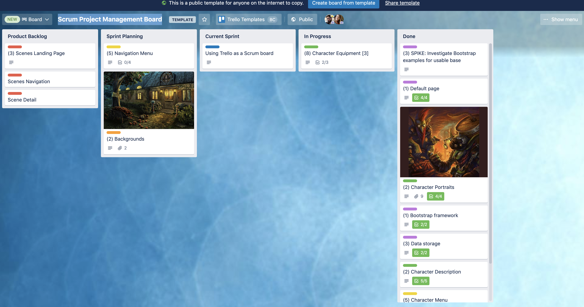

- Link to this template can be found [here:](https://trello.com/b/0xzkRjTH/scrum-project-management-board)

## Tips for excelling at Agile with Trello

1. Move the **Done list** to the far left side of the board

2. Minimise the amount of tasks in the **todo list**

3. Include an extra list for tasks in **pending status**

# Q4: Provide an overview and description of a standard source control workflow 

- Source control is the process of tracking and managing changes to code; allowing developers to work on the correct version of source code. Although source control and version control are often used interchangeably, they do slightly differ. 

- Specifically source control relates to source code while version control also includes large binary files and digital assets. In addition to source control and version control, there is also source control management (SCM). SCM relates to the tools that help developes track the changes of the source code with a complete history of these changes (Git for example).

## Workflow:

## Start a new project:

		git init

- Executing this command in the root folder of a project will create a new and empty repository.

## Work on files 

- Work on your files within IDE or editor. 

## Overview Status

		git status

- Running the git status command will display what has happened since your last commit (were any new files created or deleted etc).

## Add files to the staging area

		git add <filename>

- It's important to note that while you may have changed a file, it does not mean it is ready to be commited. This is why we have to execute the git add command. This explicitly adds whatever files you want to the "staging area".

## Commit all staged changes

		
        git commit -m “message”

- Executing a git commit command will wrap all the changes made from the previously staged files and record these changes in the Git database (Github for example).

## Check status

		git status

- By running the git status command after a commit, you can see which changes have been recorded to the Git database and which are only changed on your local machine.

## Inspect git history

		git log

- Running git log will list all the commits made in chronological order; allowing for an easy illustration of what changes where made over the course of the project. 

## Push changes to remote repository

        git push

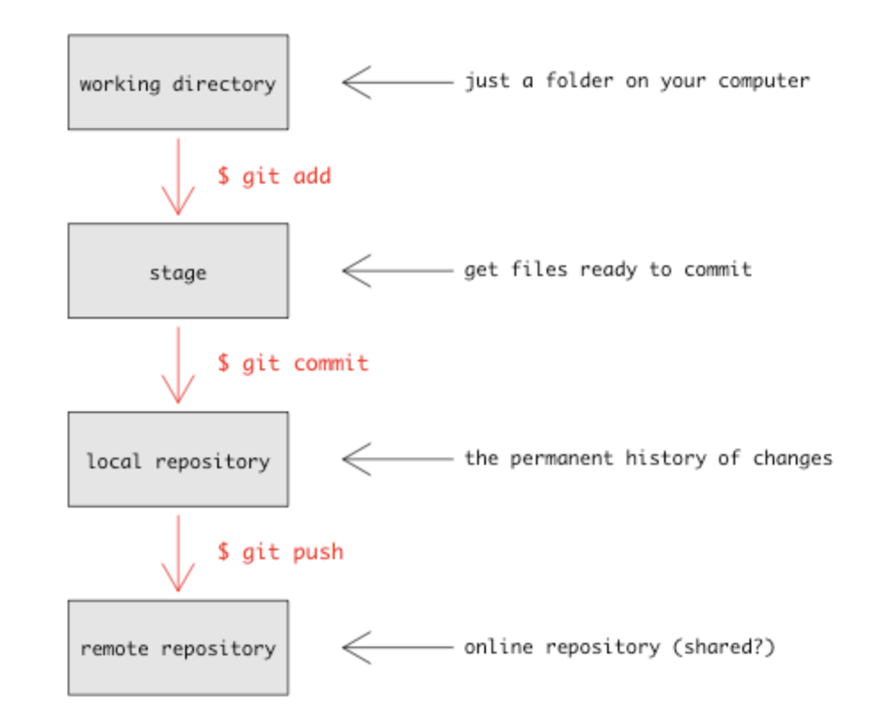

## Branching

- Branching refers to an independent line of development. 

- They serve as an abstraction for the edit/stage/commit process. 

- In other words, branching can be viewd as a way to request a brand new:
    -  working directory

    - staging area

    - project history

- In this way, new commits are recorded in the history of the current branch. 

- This will result in a fork in the history of the project.

        git branch

- The git branch command lets you create, list, rename, and delete branches. 

- "It doesn’t let you switch between branches or put a forked history back together again. For this reason, git branch is tightly integrated with the git checkout and git merge commands." (https://www.atlassian.com/git/tutorials/using-branches)

"Branches are just pointers to commits. When you create a branch, all Git needs to do is create a new pointer, it doesn’t change the repository in any other way." (https://www.atlassian.com/git/tutorials/using-branches)

## Checkout 

"Git checkout works hand-in-hand with git branch. The git branch command can be used to create a new branch. When you want to start a new feature, you create a new branch off main using git branch new_branch. Once created you can then use git checkout new_branch to switch to that branch. Additionally, The git checkout command accepts a -b argument that acts as a convenience method which will create the new branch and immediately switch to it. You can work on multiple features in a single repository by switching between them with git checkout." (https://www.atlassian.com/git/tutorials/using-branches)

        git checkout -b ＜new-branch＞

"When collaborating with a team it is common to utilize remote repositories. These repositories may be hosted and shared or they may be another colleague's local copy. Each remote repository will contain its own set of branches. In order to checkout a remote branch you have to first fetch the contents of the branch." (https://www.atlassian.com/git/tutorials/using-branches)

        git fetch --all

In modern versions of Git, you can then checkout the remote branch like a local branch. (https://www.atlassian.com/git/tutorials/using-branches)

        git checkout ＜remotebranch＞

# Q5: Provide an overview and description of a standard software testing process

The primary goal of **testing** is to make sure our program is **functional.**

- Functional

    - Does it meet the requirements that have been set out by this application?

- Usability

    - How easy is it for our user to use the application?
Are they able to use all the functions that they need to use and is it intuitive?

- Reliable

    - What happens if we are given unexpected input or invalid input? 

- Scalable

    - As we put more load on the application, more users or more objects in the data base, does our application still perform they want hat we expect to?

- Secure

    - We want to make sure that if we are storing any data about our users that we are protecting that data.

## Unit testing

- Unit testing is perhaps one of the most important types of testing.
It is done from the very start of the development process and often accompanies Test driven development (TDD). A lot of times the majority of tests in a particular project are unit tests.
Unit tests are referred to as automated tests; meaning developers write tests that automatically test the code without having to manually test that things are working. Specifically, unit tests are used to test things at the level of a unit or a single functional (The smallest parts of our program that do something). In other words, unit tests help developers make sure that given particular input will always get the expected output.

- Some example of testing frameworks that we can use for unit testing are:

  - Rspec, MiniTest or TestUnit (Ruby)
  - Mocha or Jest (JavaScript)

- In addition to unit testing there are also:
 
  - End to end testing
  - Acceptance testing
  - Non functional testing
  - Usability testing
  - Manual testing
  - Automated testing

ADD RSPEC CODE!

# Q6: Discuss and analyse requirements related to information system security and how they relate to the project

- *Having suffered several cyber attacks in the past and resultant remedial audits ACME Corporation takes compliance, security and privacy very seriously. The following set of questions relate to this RfQ-requirement.*

Information systems security (INFOSEC) refers to the approaches and processes involved with maintaining informations confidentiality, availability and assuring its integrity. INFOSEC is often summed up by the CIA triad which refers to:

- **Confidentiality**

    - Data is considered confidential when only the people who are authorized to access the data can do so. In this manner, ensuring confidentiality will require ACME Corporation to indentify and block attempts of  unauthorised access. In order for ACME Corperation to maintain confidentiality, it is suggested they take advantage of modern encryption and authentication whilst ensuring they have secure passwords throughout the organisations data.

- **Integrity**

    - Data integrity refers to maintaining the state of data and preventing it from being improperly modified. This includes both accidental modification and changes made by malicious entities. Data integrity also refers to the notion of non-repudiation. Therefore, ACME Corporation will need to set up systems that can prove they have maintained the integrity of the data they collect. This will help ACME Corporation be prepared for any legal events involving data. Additonally, the techniques ACME uses to ensure confidentiality will also help protect data integrity. In addition to these, it is advised that ACME Corporation takes advantage of modern version control which will help restore any data to a correct state if required. 

- **Availability**

    - Data availability can be described as the mirror image of confidentiality. Herein lies a challenge ACME Corporation will need to consider and be prepared for. Specifically, ACME Corporation will need to ensure that the data they collect can be accessed by the entities who have the correct permissions. This needs to be achieved whilst ensuring the data can not be accessed by unauthorised entities. Therefore it is recommended that ACME Corporation consider their network and computing resources and be sure to match them with the volume of data access they expect will be required for their secruity systems.  

## Security obligations:

In the modern digital world, companies are recieving security threats on a constant basis. Therefore, it is critical for organisations to understand security requirements. Understanding the information security requirments is considered "the all-important first step to developing a robust information security strategy" (ProServeIT, 2020). In this manner, I suggest ACME Corporation to put time aside to fully understand the types of attacks they need to be prepared for. Furthermore, it is important for ACME Corporation to understand their obligations in order to be confident they are well positioned and up to date with the necessary requirements. 

There are 3 types of security obligations organisations need to consider when dealing with information security requirements. Therefore I consider the following to be relevant to the future of ACME Corporation. 

## Overview:

### 1. Business Obligations

- These refer to the security commitments ACME Corporation will need to commit to. In short, it is the responsibility of ACME  Corporationto ensure that all the information is kept secure and is available all at times. This includes customer data, employee files etc.

### 2. Regulatory Obligations: 

- These refer to the legal obligations ACME Corporation will need to adhere to includind compliance and contractual obligations. 

### 3. Customer Obligations: 

- These refer to the security commitments that ACME Corporation will be need to commit to relative to their customers expectations.

## Business Obligations for ACME Corporation

The COVID-19 pandemic and its effects on businesses illustrates the largest obligation ACME Corporation will need to commit to. Specifically, ACME Corporation will need to have their information security requirements take business continuity into account when dealing with information security requirements. It is also important for ACME Corporation to maintain their end-user security by training their team with the aim to limit the end users’ exploitability whilst identifying and managing the information security risks. Therefore ACME will need to define and prioritise the risks related to systems and data.

Further Obligations ACME Corporation will need to implement are the commitment to securing sensitive or critical information from unauthorized access and disclosure. While this may seem obvious, this leads to additional expectations; namely, proper access control, encryption, and threat management. Strategies for adhering to these obligations must innovative processes; allowing ACME to enable new technologies when appropriate. 

## Types of attacks:

One way to ensure ACME Corporation is prepared and implementating secure systems is for the organisation and its team members to be educated with the most common attacks. 

### Phishing

- Phishing refers to the an attack which collects sensitive information. This is achieved by sending emails which are to be from a legitimate business but in reality are a scam. Often, the inforatiom that is collected is related to credit card details or login credentials. 

### Ransomware

- Ransomware refers to a type of malicious software that infects the target's machine. This can be achieved by locking the user out of their mcahine, encrypting the users files or by threatening to publish confidential information. 

### Inside attacks

- Inside attacks refers to an attack where an entity with administrative privileges intentionally hacks into confidential company information

### Malware

- Malware is short for “malicious software” and refers to any kind of attack which is intentionally introduced to the targets computer in order to gain unauthorised access or to cause damage to the system. 

### Password attacks

- This refers to an attack which gains access to a users password either through keylogging (tracking the target's keystrokes) or using a program to try different combinations of characters to find the password. 

# Q7: Discuss common methods of protecting information and data and how you would apply the to the project

The data that ACME Corporation creates, collects, stores, and exchanges is considered a valuable asset. Therefore, it is critical to safeguard the data from corruption and unauthorized access. I suggest the team at ACME Corporation to review The General Data Protection Regulation (GDPR) which covers:

- What GDPR is and its Penalties

-  Data Privacy Best Practices

- GDPR Checklist & Requirements

- How GDPR’s Requirements Affect Your Business

By understanding this document and the importance of data security, ACME Corporation will be prepared to make a plan to help protect their data. While there are many technologies to help ensure data protection, below are some key areas which ACME Corporation should take into consideration.

For more information on the GDPR click [here](https://looker.com/learn/gdpr-whitepaper).

## Authentication 

- Authentication technologies verify if a user’s credentials match the credentials stored in a database. Modern authentication processes often include a combination of ways to help indentify a user. These include passwords, PINS and security tokens.

- To make authentication simpler and more effective, it is advised ACME Corporation use a single sign-on technology with only one security token. With this single sign-on, user of ACME Corporation's product can access to additional system, platforms and applications. 

## Access control

- Access control can facilitate authentication and authorisatiom through various methods. These include discretionary access control which will allow access to ACME Corporations resources based on the identity of users or groups. Anther method used to implement access control is refered to as role-based; assigning the access based on the role of the user relative to ACME  Corporation. Lastly, there is the mandatory access control which refers to the system administrator who has access to all the information. 

## Backups & recovery

- In order for ACME  Corporation to be prepared for a system failure, breach or data corruption, it is highly recommended they do regular data backups. Specifically, ACME should be making copies of their data and storing it on seperate systems or in the could. In this way, the restoring of lost data can be easily accessed. 

## Encryption

- In addition to the above data security suggestions, it is highly recommended that ACME Corporation include data encryption in their plan to protect data. This will prevent unauthorised entities from entering systems by using an algorithm called a cipher; turning text into encrypted ciphertext. This means the data can only be decrypted by a user with an authorised key. Importantly, the storing of these encrypted keys needs to be managed wisely. Therefore, it is advised that ACME Corporation should include an off-site encryption backup with restricted access. 

## Data masking

- Data masking refers to software that hides data with obsure letters, numbers and proxy characters. In this manner, the data can only be accessed by an authorised user. When such an authorised user gains access, the data will be restored to its original state.

## Tokenization

- The process of tokenizing substitutes data with random characters. Importantly, this is not algorithmically reversible; making it particularly challenging to breach. The way tokenization works is slightly different to encryption which uses a mathematical algorithm. With tokenization, the data is stored on a seperate secure platform while the token which represnts the real data is used across a variety of different systems as a replacement. 

## Deletions & erasure

- Erasure is the process of permanently clearing digital data which is no longer needed. Importantly, erasure differs from deletion which simply hides the data rather than permanently clearing it. Therefore it is recommended that ACME Corporation implement a process of erasure and keep in mind the differences between erasure and deletions when attempting to clear digital data.

# Q8: Research what your legal obligations are in relation to handling user data and how they can be met for the project 

In order to outline the legal obligations of handling user data and its relationship to the ACME Corporation, I have sourced an Australian Government document titled *Rights, responsibilities and roles of data users*. The document clearly outlines appropriate definitions and as suggested by the title, the legal obligations and responsibilities of data users. I consider the overview of the document below to be of practical use for ACME Corporation. 

- Link to *Rights, responsibilities and roles of data users* can be viewed [here](https://toolkit.data.gov.au/files/Rights,_responsibilities_and_roles_of_data_users_Dec2013.pdf).

Additionally, I have sourced *The Privacy Act 1988* which
was introduced to promote and protect the privacy of individuals and to regulate how Australian Government agencies and organisations handle personal information. The document outlines the organisations and agencies the Privacy Act covers and those it doesn’t.

- The document can be viewed [here]().

Lastly, a quick reference to the Australian Privacy Principles which also includes the relevant information for applying the principles. This source can be found [here](https://www.oaic.gov.au/privacy/australian-privacy-principles/australian-privacy-principles-quick-reference/).

### Data Users:

- The term data user refers to a person involved in accessing and investigating integrated datasets. Specifically for statistical and research purposes. This includes academics who work in research institutions and employees undertaking research in Commonwealth and state/territory agencies. The term data user in plural may also refer to multiple data users working as part of a consortium, alliance or collaborative network. 

- Given ACME Corporation aims to be competitive and relevant, it is encouraged ACME Corporation should embrace the benefits of big data. In this manner, it is fair to suggest ACME Corporation will be involved in accessing and possibly investigating integrated datasets.

- Therefore, it is recommended ACME Corporation seriously consider the following outline. 

### Rights and Responsibilities 

- There are a number of rights and responsibilities associated with accessing and using integrated datasets which ACME Corporation should familiarise themselves with. These rights and responsibilities relate to integrated datasets that involve the use of at least one Commonwealth dataset. Additionally, these rights and responsibilities 
exist within the governance and institutional framework which is designed to help minimise risks associated with managing data.

- ACME will be required to consult with data custodians and the integrating authority if they are to make any material changes or updates to a data integration project. This will be required 
regardless of whether any such changes originate from data custodians or integrating authorities. Additionally, the consultative process will be led by a data custodian(s) who are required to approve the ACME project before proceeding to an integrating authority. 

- According to the sourced document - *Rights, responsibilities and roles of data users*, this consultation is to be done before data users start examining integrated datasets; aiming to raise issues of integrating authorities (technical feasibility of ACME Corporation) or any limitations of the data use. 

- Importantly, ACME  Corporation are entitled to receive appropriate training covering which will cover high level statistical integration principles, governance and institutional arrangements, data protocols,legislative frameworks and security requirements. Such training is to be facilitated by integrating authorities. The integrating authorities will allow ACME Corporation to have access a range of self-help tools to enhance their understanding of the Commonwealth arrangements.

- Another key take-away within *Rights, responsibilities and roles of data users* illustrates that I consider relevant to the project is that ACME Corporation must be aware of and understand the sanctions which apply for attempts to identify individuals or organisation. This includes re-identifying individuals or organisations. Therefore it is important that ACME Corporation be informed of what is considered misuse of data. 

- In a case where a data breach is made and ACME is responsible, the company will have to  pay cost recovery payments to data custodians, where applicable.

- The image below illustrates The Commonwealth’s data integration arrangements by outlining how data users fit within the arrangements, and their interactions
with data custodians and integrating authorities.

## The Australian Privacy Principle

- The Australian Privacy Principles apply to any organisation or agency the Privacy Act covers. The Privacy Act defines an ‘organisation’ as:

    - an individual, including a sole trader (though generally, the Privacy Act doesn’t apply to an individual acting in a personal capacity)

    - a body corporate

    - a partnership

    - any other unincorporated association, or
a trust

Given ACME is a corporation, it will fall under the Privacy Act as an organisation.

- According to *The Privacy Act 1988* 
‘Personal information’ is defined as any ‘information or an opinion about an identified individual, or an individual who is reasonably identifiable

    - whether the information or opinion is true or not; and

    - whether the information or opinion is recorded in a material form or not’ (s 6(1))

- This clarifying of definitions are crucial for ACME  Corporation to be informed of their responsibilties. Further clarification can be found at https://www.oaic.gov.au/

- The Australian Privacy Principles consist of 13 APPS which refer to a clearly expressed and up to date policy about the management of personal information by the entity/APP.

- Below is a list of the 13 principles. A full breakdown of each principle can be found [here](https://www.oaic.gov.au/privacy/australian-privacy-principles/read-the-australian-privacy-principles/).

## 13 Principles

#### **NOTE: This text comes from the above link and is not to be considered original. Rather, it servers as a quick illustration to help ACME Corporation identify what they need to take into consideration when dealing with personal data.**

###  1. Open and transparent management of personal information

- The object of this principle is to ensure that APP entities manage personal information in an open and transparent way.

### 2. Anonymity and pseudonymity

- Individuals must have the option of not identifying themselves, or of using a pseudonym, when dealing with an APP entity in relation to a particular matter.

### 3. Collection of personal information

- If an APP entity is an agency, the entity must not collect personal information (other than sensitive information) unless the information is reasonably necessary for, or directly related to, one or more of the entity’s functions or activities.

### 4. Dealing with unsolicited personal information

- If an APP entity receives personal information; and
the entity did not solicit the information;
the entity must, within a reasonable period after receiving the information, determine whether or not the entity could have collected the information under Australian Privacy Principle 3 if the entity had solicited the information.

### 5. Notification of the collection of personal information

- At or before the time or, if that is not practicable, as soon as practicable after, an APP entity collects personal information about an individual, the entity must take such steps (if any) as are reasonable in the circumstances:

    a) to notify the individual of such matters referred to in subclause 5.2 as are reasonable in the circumstances; or

    b) to otherwise ensure that the individual is aware of any such matters.

### 6. Use or disclosure of personal information

- If an APP entity holds personal information about an individual that was collected for a particular purpose (the primary purpose), the entity must not use or disclose the information for another purpose (the secondary purpose) unless:

a) the individual has consented to the use or disclosure of the information; or

b) subclause 6.2 or 6.3 applies in relation to the use or disclosure of the information.

### 7. Direct marketing

- If an organisation holds personal information about an individual, the organisation must not use or disclose the information for the purpose of direct marketing.

### 8. Cross-border disclosure of personal information

- Before an APP entity discloses personal information about an individual to a person the entity must take such steps as are reasonable in the circumstances to ensure that the overseas recipient does not breach the Australian Privacy Principles (other than Australian Privacy Principle 1) in relation to the information.

### 9. Adoption, use or disclosure of government related identifiers

- An organisation must not adopt a government related identifier of an individual as its own identifier of the individual unless:

a) the adoption of the government related identifier is required or authorised by or under an Australian law or a court/tribunal order; or

b) subclause 9.3 applies in relation to the adoption.

### 10. Quality of personal information

- An APP entity must take such steps (if any) as are reasonable in the circumstances to ensure that the personal information that the entity collects is accurate, up-to-date and complete.

### 11. Security of personal information

- If an APP entity holds personal information, the entity must take such steps as are reasonable in the circumstances to protect the information:

a) from misuse, interference and loss; and

b) from unauthorised access, modification or disclosure.

### 12. Access to personal information

- If an APP entity holds personal information about an individual, the entity must, on request by the individual, give the individual access to the information.

### 13. Correction of personal information

- If: 

a) an APP entity holds personal information about an individual; and

b) either:

- the entity is satisfied that, having regard to a purpose for which the information is held, the information is inaccurate, out of date, incomplete, irrelevant or misleading; or

- the individual requests the entity to correct the information;

- the entity must take such steps (if any) as are reasonable in the circumstances to correct that information to ensure that, having regard to the purpose for which it is held, the information is accurate, up to date, complete, relevant and not misleading.

# Q9: Describe the structural aspects of the relational database model. Your description should include information about the structure in which data is stored and how relations are represented in that structure.

The structure of a relational database is considered to be explicit and requires careful alteration once the database is being used. In this manner, using a relational database is not recommended when the structure of the data is changing or may be different within certain instances of the data.

## Set 

- A set refers to the grouping of **similar things.**

- Sets are foundational in performing useful queries with relational databases. 

- Sets can be illustrated using a *Venn Diagram*.

- Example set: **Things you wear.**

  - Shirts
  - Shoes
  - Socks 
  - Coats

- Additionally, you can have a specific set for Shirts:

  - T-shirt
  - Dress-shirt
  - Sweaters 

- Therefore, items like shoes and socks will appear in the first set but are not in the second set given socks and shoes are approprite for things you wear but not for specific shirts. 

## Dataset 

- Collection of rows with the same column definitions.

## Keys 

### Primary Keys

- A primary key is an **attribute** or field that uniquely identifies **every record** in a certain table. Given this can be accomplished with a **single attribute**, you will only have ONE primary key per entity.

### Primary Key Rules:

1. Has to be unique

    - A primary key will indentify only ONE record in a table. 

2. Never Changing

3. Never-Null 

    - Simply put, the value can NOT be left **blank.** 

### Foreign keys

- Unlike a primary key, foreign keys do NOT have to be unique and CAN be **repeated in a table**. Another differnce between primary and foreign keys is that there can be **multiple** foreign keys in a **single entity.** 

- Foreign keys are attributes from one table referenced in a related table. 

- In short, foreign keys create relationships between tables. 

### Composit Primary keys

1. Uses the **fewest number** of **attributes** possible to generate a **composite primary key.**

2. **Does not** use attributes that will **change.** 

### Unique keys

- A specifically configured column so that no value can be repeated within it.

- Multiple unique keys can exist per table.

- "For example, a unique email address column could also be in the same table as a unique Social Security number column."

"Also, values in unique columns can be changed to new values as long as they don't conflict with any existing values in that column."

## Relational Database: Overview

- Relational Databases in the real world are very large and can contain millions of rows in a single table. 

 - The term Relational Database refers to the way the databases are structured and linked by shared attributes. These links are what's considered teh relationship between tables. 

- While there are many reasons why Relational Databases have become the standard for application data storage, one key element is their ability to reduces storage requirements on disks by eliminating redundant data.

- Relational databases organise data in tables with **rows** and **columns.**

- The **table** represents a **relation** because it **defines** the ways that the **data relates as information.**

- The **columns** indicate **attributes** (also known as domains or types) for the data.

- The **rows** (also called tuples) represent individual **records** in the table.

- One example of a **Relational Database** is a **spreadsheet.**

- Each **entity** (or object type) would be defined in its own **table.**

## Entity

- An **entity** represents a person, place or thing that you want to **track in your database.** 

- Each **occurance of an entity** is referred to as an **entity instance** which will become a **record/row in the table.** 

## Store example: Entities & Attributes

    - Items 

        - Name
        - Description
        - Price
    
    - Customers

        - Name
        - Email 
        - Address

    - Orders

        - Date
        - Customer
        - Items with quantities
        - Total price 

In the above example the entities are:

- Item, Customers and Orders.

- Underneath each Item follows their respective attributes (Name, Description etc).

## Store example: Relationships

The **first step** to defining the relationships that we have to include in the structure of our table is: *We think about our entities and we create sentences that describe the way each entity relates to the other.*

- How is a customer associated with an order?

    - A customer places an order.

- How is an item associated with an order?

    - An order contains at least one item.

- When talking about relationships, we need to define the **cardinality** and **ordinality** of the relationship. 

## Cardinality

- Cardinality expresses the **maximum** number of one entity with which an entity relates.

    - An order is made by **one customer** (one).

        - For example: If we have an order that has been placed, it will be placed by a single customer. NOT multiple customers, NOT no customers but one single customer. 

    - An order can contain many items (many).

        - For example: An order can contain many items. It will contain one item, but it could potentially contain many items. 

## Ordinality

- Ordinality expresses the **minimum** number of one entity with which an entity relates. 

    - A customer can have 0 orders (optional relation).

        - For example: It's possible a customer may not place an order. 

    - An order contains at least one item (mandatory relation).

        - For example: An order must contain at least one item. Otherwise it is not considered a valid order. 

- These expressions of the numbers that relate to each other are realy important as it effects the way that we define our database model. 

## One to one relationship (Store example)

- If we separate addresses from custromers into a seperate addresses table, the relationship between custromer and address would be: 
    - One to One relationship.

- A **customer** has **one address.**

- An **address** belongs to **one customer.**

## One to many relationship (Store example)

- The relationship between customer and order is a one to many relationship. It is mandatory that an order has at least 1 customer and it is optional for a customer to make an order. 

- An order has exactly 1 customer.

- A customer can have 0 or more orders.

## Many to many relationship (Store example)

- The relationship between order and items is a many to many relationship. 

- An order can have many items (at least one item).

- An item can belong to many orders (or no orders at all).

- A many to many relationship is often modelled with a joining tables (in relational databases).

## Relationship symbols

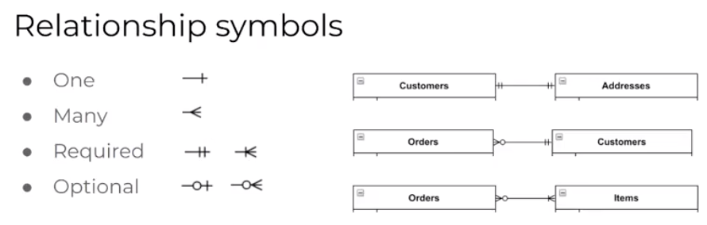

## One

One relationship (Customers & Addresses): 

- Where a customer has one address and an address has one customer.

- We use a little vertial line (at the end of the line connecting the two entities). 

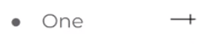

- If we want to indicate that this relationship is a required relationship: 

    - Meaning an addresss MUST have one customer.

    - And a customer MUST have one address. 

- We use a double vertical line.

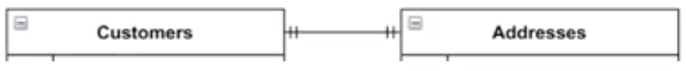

- In other words, the second vertical line indicates that the relaionship is required. 

## Many

Many relationship (Customers & Orders):

- Where a customer can have many orders. 

- We use the crows foot to indicate a many relationship. 

- If look at the image below:

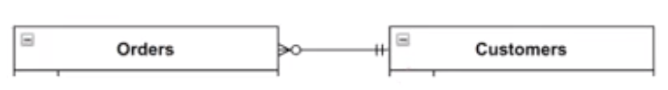

- It reads (right to left):

    - A Customer can have 0 or more orders. 

- It reads (left to right):

    - An order has exactly one customer. 

## Optional

- The image below shows how we illustrate an optional relationship: 

- The first symbols reads as optinal 0 to 1 and the second reads optional 0 to many.

## Normalisation

Nornalisation is the process of identifying and eliminating elements in a database design that if left in place, would make the database perform poorly or have inconsistent data.

## 1NF

The first normal form (1FN) says the table MUST meet the constraints of a Relational Database:

- The column names need to be unique.

- Order of records does not matter.

- Records in one column must be of the same type.

- Must have atomic values in columns (single values).

## 2NF

The second normal form (1FN) says the table MUST meet the constraints of a Relational Database:

- It should be in the First Normal form.

- It should not have Partial Dependency.

## 3NF

The third normal form (1FN) says the table MUST meet the constraints of a Relational Database:

- It is in the Second Normal form.

- And, it doesn't have Transitive Dependency.

## Designing a relational database model

- Before implementation, it is important to design your relational database using a physical ERD. 

- A physical ERD (entity relaionship diagram) represents the way data is physically modelled in the database. 

- A physical ERD represents the schemas (defined structure) for the database tables. 

- We can then use our ERD to inform how we should create our database tables.

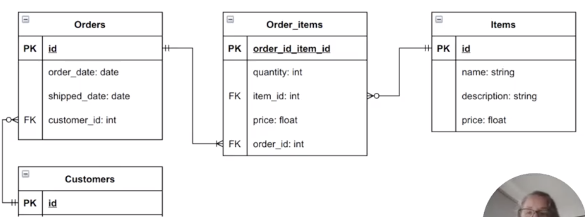

# Q10: Describe the integrity aspects of the relational database model. Your description should include information about the types of data integrity and how they can be enforced in a relational database.

## Entity integrity

- Entity integrity means **no two rows** can be the **same** in a **table.** This can be achieved by defining a **primary key** in which the primary key field contains a **unique id**. Therefore, **no two rows** can have the same **unique id.**  With this in mind, if you define a primary key for each entity, then they follow the **entity integrity rule.** The uniqueness property of entity integrity ensures that the **primary key of each row is uniquely identified**. In other words, there are NO duplicates. Additionally, the second property ensures that the primary key has a meaning/value. The entity integrity system does not allow the operations to produce an invalid primary key. If an operation creates a duplicate primary key or one which contains null it is rejected. 

## Referential integrity

- Referential integrity refers to **relationships.** For example, when two or more tables are related, it is important to **match the values** of the **foreign key** with the **primary key at all times.** If a situation arises where a foreign key has no matching primary key value in a primary table, we will get an **orphaned record.**
Referential integrity **prevents** users from adding records to a table when there is **no associated record** in the primary table. It also prevents users from **changing values** in a primary table and prevents users from **deleting records** from a primary table (when there are matching related records). 

There are three common techniques to **handle** and **enforce** referential integrity violation.

- **Reject Technique**

    -  Rolls back the statement that fired the rule with a raise error statement. This error informs the application that the some rule was violated with regards to some specified condition or constraint. 

- **Nullify Technique**

    - Another course of action to respond to a violation in a referential integrity constraint when a foreign key does not have a matching primary key is to use the Nullify technique. Nullifying refers to a situation where the columns in the records in violation of the constrainare made null. 

- **Cascade Technique**

    - Cascading is when the original update applies to other records in violation of the constraint. Specifically, when the statement that violates the constraint is an insert or update. In this case, cascading will insert the offending forein key into the primary key column. Also when the violation is a delete (deleting the primary key and all forein keys that match the primary key).

## Domain integrity

 - Domain integrity refers to the validity of the entries for any given column of a table. Therefore, selecting the appropriate data type for a given column is paramount to maintaining domain integrity. Other ways to maintaining domain integrity are:

    - Allocating appropriate constraints and rules.

These constraints and rules are used to define the data format and/or restrict the range of possible values. 

# Q11: Describe the manipulative aspects of the relational database model. Your description should include information about the ways in which data is manipulated (added, removed, changed, and retrieved) in a relational database.

*The manipulative features of relational databases provide the ways we access and modify the data*

## Manipulating Data

- Insert Data into tables.

- Query data with SELECT.

- DELETE data from tables.

## Inserting Data

- Specify column names in any order and match order of values.

- Error if required (not null, primary key) column values are missing.

        INSERT INTO <table_name> (COLUMNS) VALUES

- We give the list of columns for which we will insert data in the order of which we will specify the values.

## Retrieving Data: Select

Returns a relation containing all tuples (records) that meet some condition. In PostgreSQL, we use the SELECT statement for this, with optional clauses to limit the results.

- Retrieving data from a specific table can be done by using the SELECT statement. 

        SELECT <list_of_columns> FROM <list_of_table_names> WHERE <conditions> ;

- We can divide the SELECT statement into three main sections:

1. List of columns:

        <list_of_columns>

     - This specifies the column names that need to be retrieved from a particular table/tables. 

2. List of table names:

        <list_of_table_names>

    - the tables from which to retrieve the data.

3. Conditions:

        <conditions>

    - Parameters used for including any further restrictions on the data.

## Examples:

    SELECT * from items WHERE name = ‘beef’;

    SELECT * from items WHERE price < 10.00 LIMIT 10;

    SELECT name from items;

    SELECT quantity, item from orders;

# Q12: Conduct research into a marketplace website (app) and answer the following parts: 

Given ACME corporation values previous project experience and case studies, the decision was made to look into the successful marketplace app Airbnb. Specifically, Airbnb was chosen as a case study for ACME corporation given its track record as a trusted community marketplace and its up to date technologies offering a useful blueprint for what is required to build and maintain a successful marketplace. With over 150 million active users worldwide enjoying a stable and fast platform, the Airbnb platform architecture exemplifies what ACME should consider when looking at building a successful marketplace.

It is important to illustrate that Airbnb's architecture has differed throughout the many stages of the applications evolution. This can be made clear by the tremendous growth the company saw in 2017 with over 75 million searches each day. This led to the team at Airbnb to redesign the architecture of the web application experience. While I have done my best to list and describe the most up to date elements of Airbnb, there were some limitations to my accessing the most up to date information. It is for this reason I wish to make clear that if there are any elements which are now outdated (software, hardware etc), to the best of my knowledge, they were included at some point over the course of Airbnb's evolution and therefore may be of use to ACME Corporation.

## Airbnb

## A: List and describe the software used by the app.

- As with many high-end products of the modern era, Airbnb is a cloud-based application; allowing the company to rapidly scale and handle large workloads. The companies architecture is primarily built with the following technology stack:

    - Amazon RDS cloud database
    - Redis
    - Amazon S3 and EBS
    - Amazon CloudFront
    - Amazon EC2
    - Airpal
    - Presto
    - Druid

This relationship with Amazon is clearly illustrated with Nathan Blecharczyk, Co-founder & CTO of Airbnb claims stating,

“Initially, the appeal of AWS was the ease of managing and customizing the stack. It was great to be able to ramp up more servers without having to contact anyone and without having minimum usage commitments. As our company continued to grow, so did our reliance on the AWS cloud and now, we’ve adopted almost all of the features AWS provides. AWS is the easy answer for any Internet business that wants to scale to the next level.”

## Amazon RDS cloud database

- Amazon Relational Database Service (Amazon RDS) helps Airbnb operate and scale a relational database in the cloud. This frees Airbnb team members to focus on the applications and the business needs.

- The Amazon RDS helps Airbnb implement difficult procedures including replication and scaling which can be completed with a basic API call or through the AWS Management Console.

- Airbnb uses Multi-Availability Zone (Multi-AZ) deployment which further automates its database replication while augmenting data durability.

## Redis

- Airbnb uses Redis as an in-memory data store which helps reduce latency.

- Airbnb migrated their self-managed Redis environment from EC2 classic to a fully-managed Amazon ElastiCache for Redis. This helps Airbnb to reduce operational overhead and improve availability.

## Amazon Simple Storage Service

- Airbnb uses the Amazon Simple Storage Service (Amazon S3) which has a secure infrastructure with regards to keeping data safe in the cloud.

- This is achieved through Amazon S3 ability to distribute data in different physical regions whilst integrating PCI-DSS, HIPAA / HITECH, FedRAMP.

## Amazon CloudFront

- Airbnb uses Amazon CloudFront as their content delivery network (CDN).

- Amazon CloudFront securely delivers data with low latency and high transfer speeds.

## Amazon EC2

- Airbnb uses the Amazon EC which creates virtual machines which mange storage, security, ports and remove the need for physical servers.

## Airpal

- Airbnb uses Airpal to restrict access to data that is based on the schema and table the data is in. By using Airpal, Airbnb can limit access to views based on the view's fully qualified name.

## Presto

- Airbnb uses presto which is an open source distributed SQL query engine which allows for the running of interactive analytic queries against data sources with varying sizes.

## Druid

- Airbnb uses Druid to help with ingestion, streaming and the handling of large quantities of data whilst ensuring there are no latencies. 

### The image below illustrates the various applications and programming languages Airbnb used - sourced from stackshare.

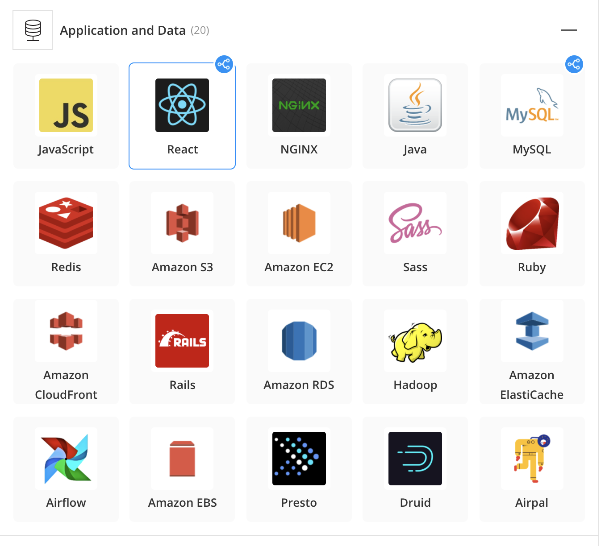

## B: Describe the hardware used to host the app.

Given Airbnb operates primarily with Amazon Web Services (AWS), they have been able to sidestep a lot of the difficulties that come with managing and servicing datacenters. Therefore, investigating the hardware used to host Airbnb will require looking at the hardware of AWS. As mentioned above, Airbnb uses the Amazon EC2 to create virtual machines which manage storage, security, ports and remove the need for physical servers. The Amazon EC2 is powered by Intel® Xeon, Scalable processors which claim to have the largest breath, global reach and availability of computer instances across AWS geographies. Additionally the Amazon EC2 is the only cloud with 400Gps ethernet networking. While it is not clear exactly what version of the Intel Xeon Scalable processor Airbnb are using, considering they have a fourteen plus year relationship with Intel, it is safe to assume Airbnb will be looking to include the latest Third-Generation Intel Xeon Scalable Processor with up to 40 powerful cores and built-in workload acceleration features that include:

- Intel Deep Learning Boost
- Intel Advanced Vector Extensions 512
- Intel Speed Select Technology

## C: Describe the interaction of technologies within the app

## D: Describe the way data is structured within the app

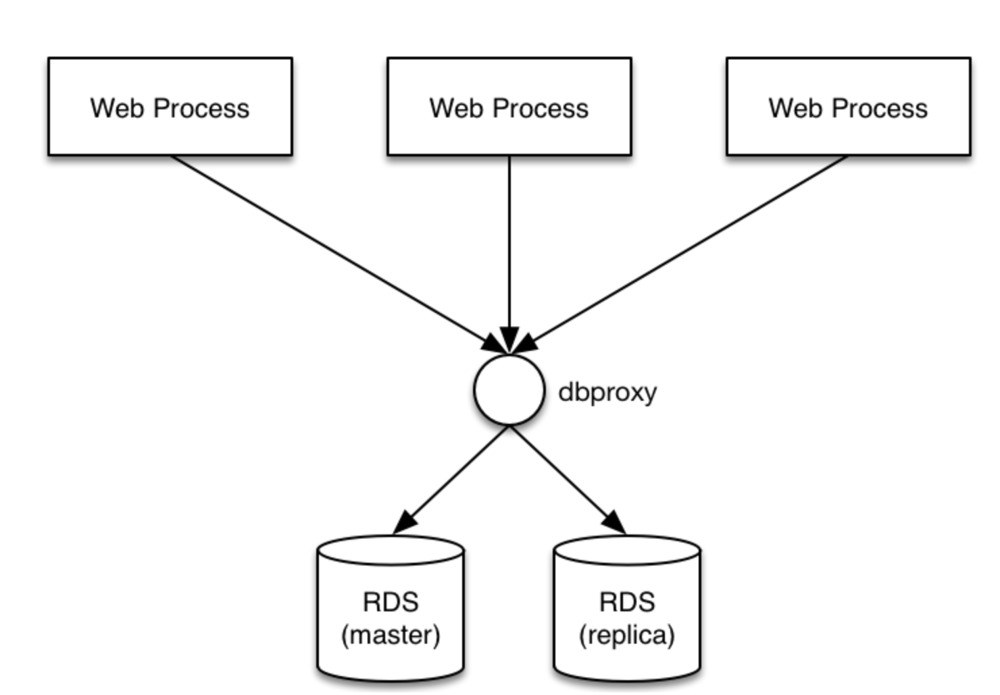

## E: Identify entities which must be tracked by the app

## F: Identify the relationships and associations between the entities you have identified in part (e)

## ERD 

# References:

https://www.proserveit.com/blog/information-security-requirements#eleven
https://www.atlassian.com/git/tutorials/using-branches
https://blog.hubstaff.com/agile-trello/

https://www.businessnewsdaily.com/4987-what-is-agile-scrum-methodology.html

https://www.atlassian.com/agile/project-management

https://stackshare.io/airbnb/airbnb

https://medium.com/@poojaseenu1999/the-technology-stack-behind-airbnb-6b23fe425612

https://www.proserveit.com/blog/information-security-best-practices

https://www.techopedia.com/definition/24840/information-systems-security-infosec

https://www.csoonline.com/article/3513899/what-is-information-security-definition-principles-and-jobs.html

https://www.proserveit.com/blog/information-security-requirements

https://www.slideshare.net/AmazonWebServices/airbnbs-journey-from-selfmanaged-redis-to-elasticache-for-redis-dat319-aws-reinvent-2018

https://medium.com/airbnb-engineering/druid-airbnb-data-platform-601c312f2a4c

